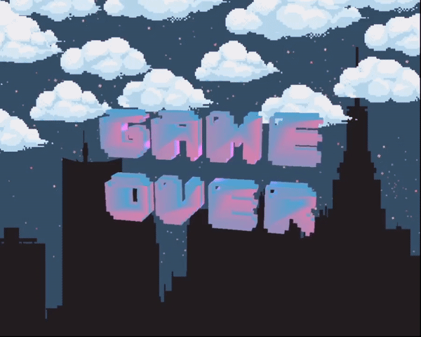

# tarea2Snake3D

  
  
  

#### ⚠WARNING⚠: The game presents fast color changes, it's recommended to avoid its execution if there's a history of epilepsy.
#### ⚠WARNING 2⚠: Game's song volume can vary on your device, caution is advised when executing it.

## Summary
A clone of the classic «Snake» game, where instead of a snake we control a conga line, which adds a new member every time the vinyls spread across the dance floor are picked up.

## Title Screen

  

## Gameplay Screenshots

  
  
  

## Game Over Screen

  

## Gameplay Showcase

  Link to YouTube video: <a href="https://youtu.be/0-iRIRXAfPA">SNOK 3D Showcase 🕺🕺🕺</a>

